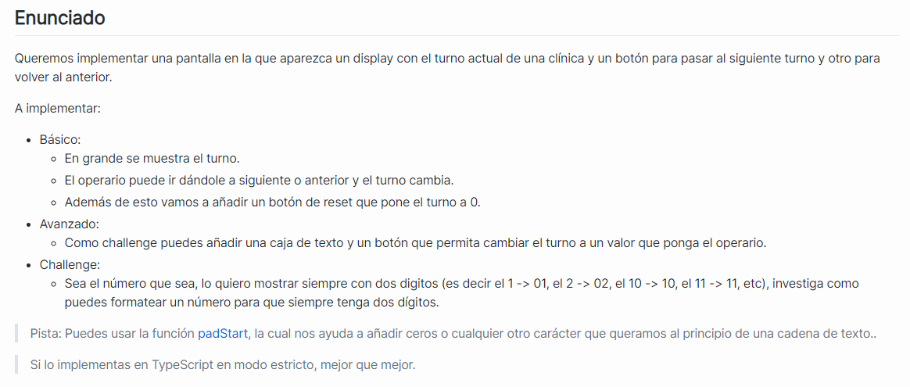

# bootcamp-modulo4

Laboratorio del modulo 4 del Bootcamp JavaScript 2

<!DOCTYPE html>
<html lang="en">
  <head>
    <meta charset="UTF-8" />
    <link rel="icon" type="image/svg+xml" href="/vite.svg" />
    <link rel="stylesheet" href="./src/style.css" />
    <meta name="viewport" content="width=device-width, initial-scale=1.0" />
    <title>Vite + TS</title>
  </head>
  <body>
    

      <h1 class="numero-turno">01</h1>
      
Por favor, acérquese al mostrador

    

    
  </body>
</html>

.turno-display {
display: flex;
flex-direction: column;
align-items: center;
justify-content: center;
background-color: #fff;
border: 1px solid #ddd;
padding: 20px;
border-radius: 10px;
box-shadow: 0 0 10px rgba(0, 0, 0, 0.2);
}

.numero-turno {
font-size: 6rem;
font-weight: bold;
margin: 0;
}

.texto-turno {
font-size: 2rem;
font-weight: bold;
margin: 0;
text-align: center;
}
